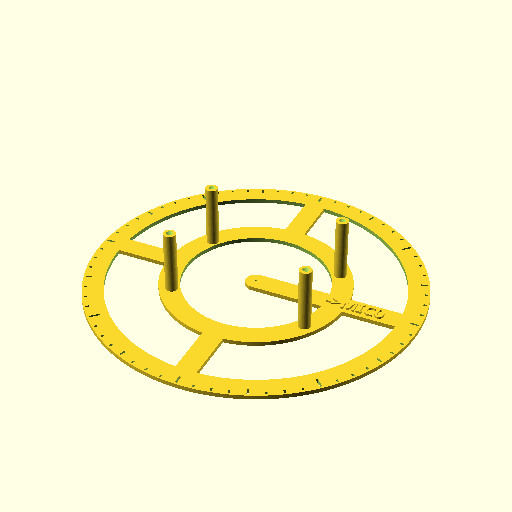

# Direction of arrival for BeagleMic

This is an attempt to implement a direction-of-arrival estimation
using machine learning. Source of audio data is the
[BeagleMic](https://gitlab.com/dinuxbg/beaglemic).

It's still work in progress. It's my first attempt at playing with
machine learning. The model and code are still naive and not optimal.
DOA estimation is still not accurate.

## Recording audio data for training

Most ML tutorials utilize pre-made training datasets (e.g. MNIST, LibriSpeech).
In contrast, this project documents how to prepare your own datasets
for training.

### Setting up the test jig

For DOA it is crucial to record speech audio from different angles. A simple
stand for BeagleMic can be printed, which helps with positioning BeagleMic
at different angles.

The stand has 64 markings for every angle in the full circle with step 5.625°:

Use a pin to fix the center. Then rotate the jig for each DOA recording
accordingly.

### Obtaining audio for playback

Obtain speech recordings from e.g. [LibriSpeech ASR](http://www.openslr.org/12/).
You may also use an audio book or a podcast as a source. After obtaining audio
speech audio, convert it to a single continuous raw file for playback later:

	find  -name '*.flac' | sort | ./scripts/generate-playback-data.sh > input.raw

### Recording audio

The same `input.raw` must be played for each angle marking between MIC0 and MIC1.
Possibly for several different distances. Encode the parameters of each session
in the output file. For example, for DOA angle 5.626°, 0 meters elevation of
the audio source above BeagleMic, and 2.0 meters distance between them, use
the following command line:

	./scripts/session.sh input.raw records/output-05.625deg-0elev-2.0m.raw

The file name is important. That's how the next steps will parse the
recording's parameters.

One of the output classes of the NN is "silence". Unlike the "real" recordings
above, the playback input is entirely zeros when recording microphone data
for a silent room:

	dd if=/dev/zero of=input-silence.raw bs=1024 count=$((1024*1024))
	./scripts/session.sh input-silence.raw records/output-silence.raw

## Preparing the data

The long raw records from the microphones are still not fit for feeding the
ML training. First hey must be divided into small chunks. I have chosen 512
samples for those chunks.

Some chunks contain speech, but others may happen to be capturing only the
silence between sentences or even words.

A simple C++ program is used to parse all microphone recordings, drop
the silent chunks, and output a large number of datasets deemed suitable
for training.

The following command takes the directory with microphone recordings as its
first parameter. The second parameter is the output directory where to store
the parsed and processed datasets:

	cd ml && make
	./ml/prepare-data ./records ./dataset

## TensorFlow host setup

Setting up a GPU-accelerated tensorflow is a non-trivial task.

I have [documented](./host/README.md) the steps which worked best on my host.

To check if your GPU-enabled TensorFlow is working, inspect the output of
the following command:

	./ml/check-tf-gpu.py

## Training the NN

	./ml/train.py -i ./dataset -o model.h5

This above command performs NN training and outputs two files:

 1. `model.h5`: The actual TensorFlow model
 2. `model.json`: The DOA angle mapping to the NN output class number.

I could not find a straightforward method to embed the class names into
the final module. Hence the workaround with saving the mapping into
an external JSON file.

## Using the model

To run the model on a set of raw recorded audio chunks:

	./ml/test-model.py -i ./datasets -m model.h5

It will print the expected and actual angle output from the DOA NN model:

	Expected: 112.500, got: 112.500
	Expected: 292.500, got: 292.500
	Expected: 320.625, got: 337.500

## TODO

Here are ideas for future work and current unknowns worth investigating:

 - The original audio source is known, and also phase-aligned to the recorded audio. Use it to train a beamforming NN.
 - Should the NN model be stateless? This would be simple, but would not allow tracking moving objects.
 - Try to estimate elevation and distance, in addition to DOA angle.
 - Simplify and optimize the NN.
 - Write a GUI to show DOA estimation in real time.

## References

 - [Keras code examples](https://keras.io/examples/)
 - [TensorFlow](https://www.tensorflow.org/)
 - [FFmpeg](https://ffmpeg.org/)
 - [SoX](https://sox.sourceforge.net/)
